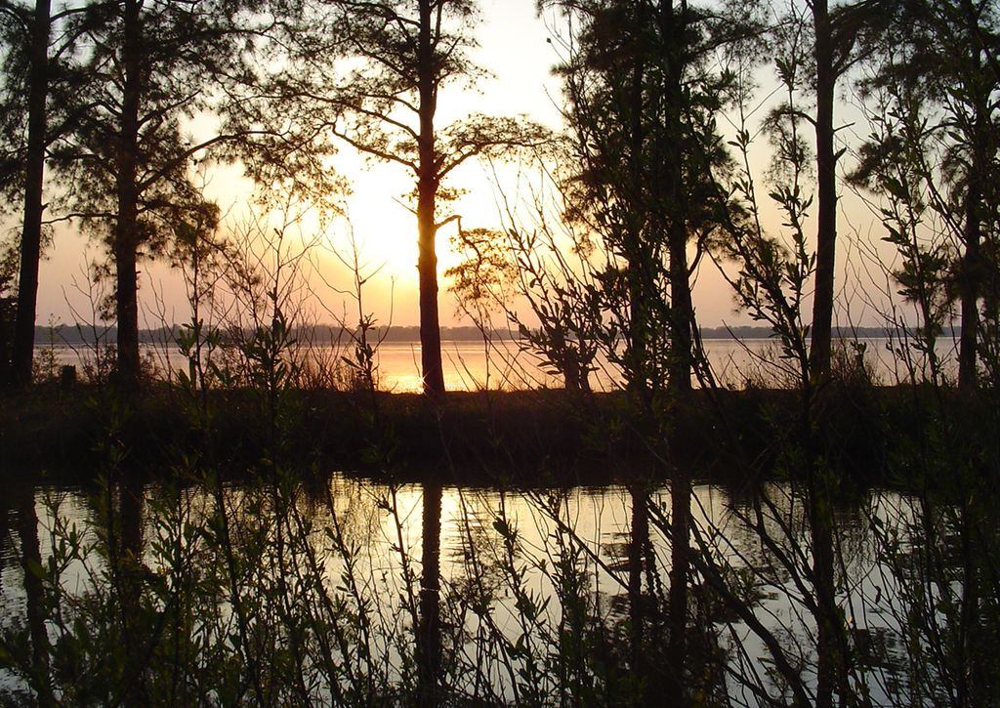

/*
Title: Image Plugin Demonstration
Description: A demonstration of the Image plugin in action.
*/

Image Plugin Demonstration
==========================

Picture by the [U. S. Fish and Wildlife Service - Northeast
Region](http://www.flickr.com/photos/usfwsnortheast/)

Image from the same folder
--------------------------

Centered thumbnail
------------------

[200]

Left aligned thumbnail
----------------------

[200 ]

Lorem ipsum dolor sit amet, consectetur adipiscing elit. Phasellus vestibulum tortor non velit egestas, et imperdiet velit dictum. Donec orci lacus, adipiscing sed neque vitae, aliquam elementum quam. Vivamus sit amet tempus neque, in iaculis risus. Integer elementum ante ac risus tempor, id venenatis massa fermentum. Curabitur diam tellus, vestibulum porta velit ornare, venenatis tristique elit. Vestibulum eros metus, volutpat a dapibus vitae, semper vitae augue. Duis euismod justo fermentum elementum tincidunt. Sed eu leo vitae orci tempor tincidunt. Sed ac interdum risus. Fusce eget dignissim dui. Phasellus massa leo, dignissim ac turpis vitae, adipiscing condimentum elit.  

Forced ratio thumbnail
----------------------

[200x200]

Thumbnail with caption
----------------------

[200]

Relative to the content folder
------------------------------

